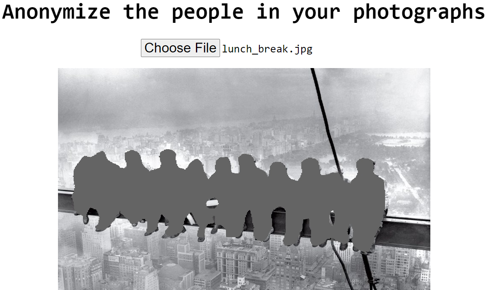

# AnonImage

### Anonymize images by erasing humans from a given picture.
Authorities are using images of protestors published on social media websites to [make arrests](https://www.vice.com/en_us/article/bv8j8w/a-tattoo-and-an-etsy-shirt-led-cops-to-arrest-woman-accused-of-burning-cop-cars).  Personal identifying information is often published without the consent of the subject.  This website gives access to a simple tool for eliminating this identifying information from images while leaving details such as signs, pets, buildings, skies, and other non-people objects intact.

*Anonymized image of protesters. Original Image Via [ABCNews](https://s.abcnews.com/images/US/stephon-clark-protest-gty-jt-180331_hpMain_2_16x9t_608.jpg)*

## Directions
Run server:
`python server.py`

## Acknowledgements
The [Chen et al.](https://arxiv.org/abs/1706.05587) ([DeepLabV3 ResNet101](https://pytorch.org/docs/stable/torchvision/models.html)) image segmentation model was used.

Resources used for server side code: [Jon Berg](https://fragments.turtlemeat.com/pythonwebserver.php), [Arunava Chakraborty](https://www.learnopencv.com/pytorch-for-beginners-semantic-segmentation-using-torchvision/)