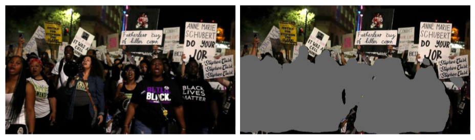

# AnonImage
### Anonymize images by erasing humans in a given picture.

*Anonymized image of protesters. Original Image Via [ABCNews](https://s.abcnews.com/images/US/stephon-clark-protest-gty-jt-180331_hpMain_2_16x9t_608.jpg)*